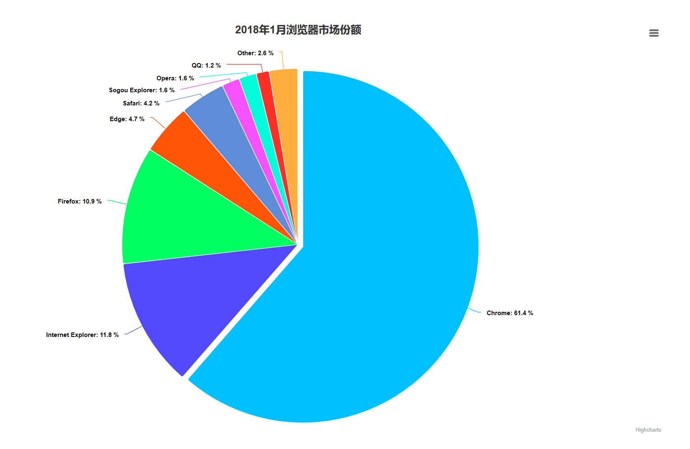
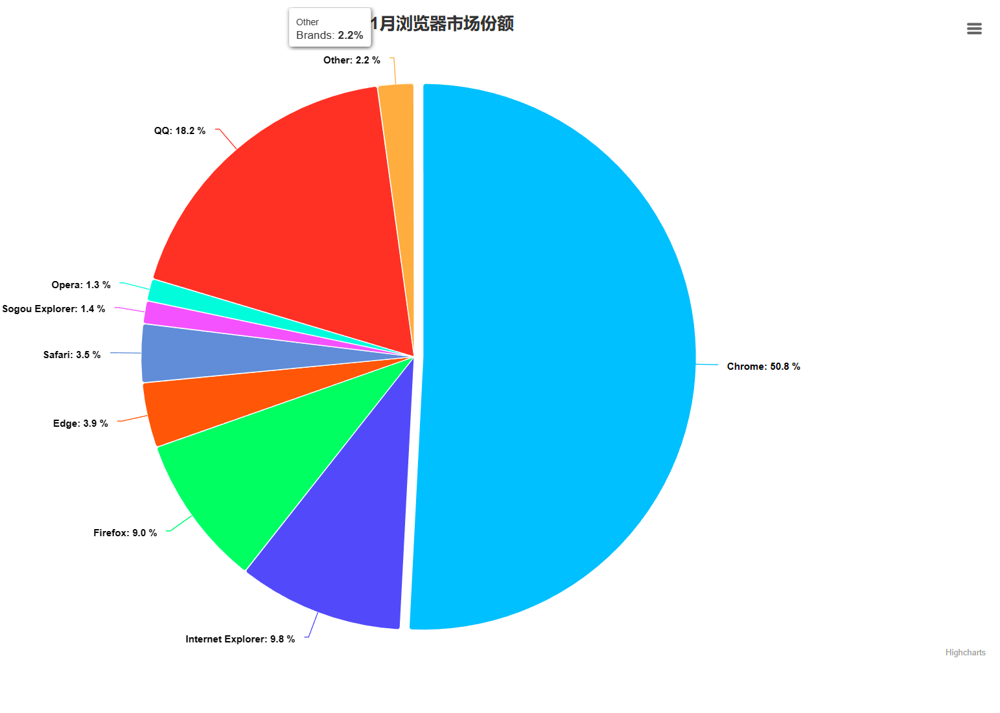
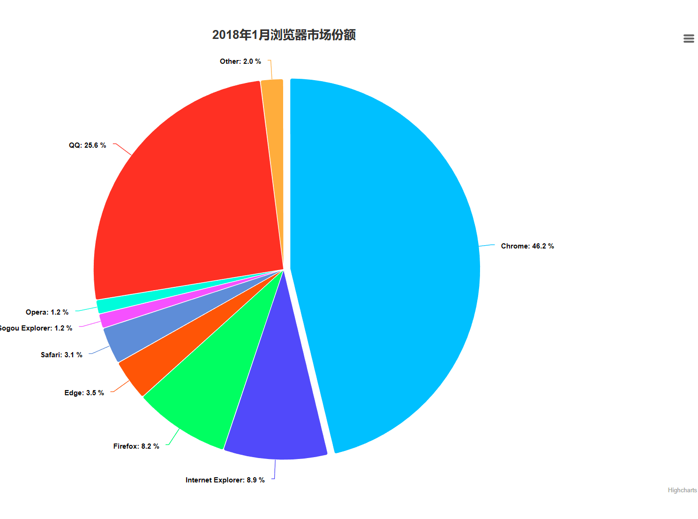
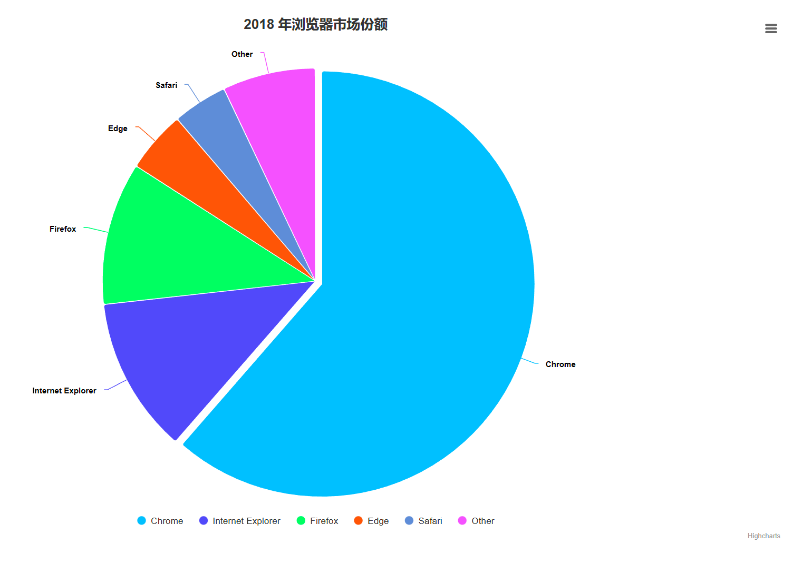
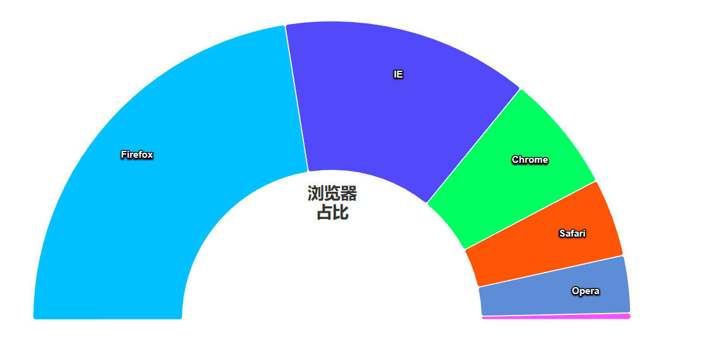
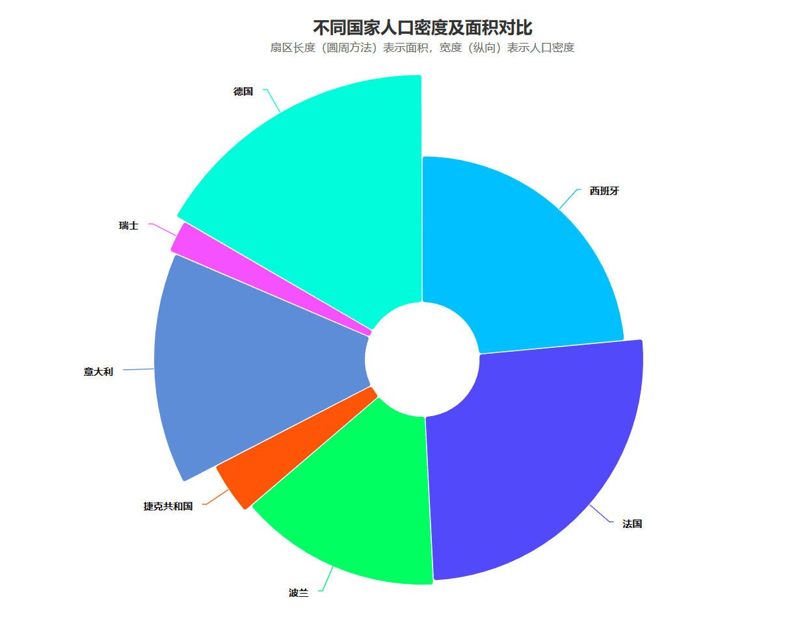
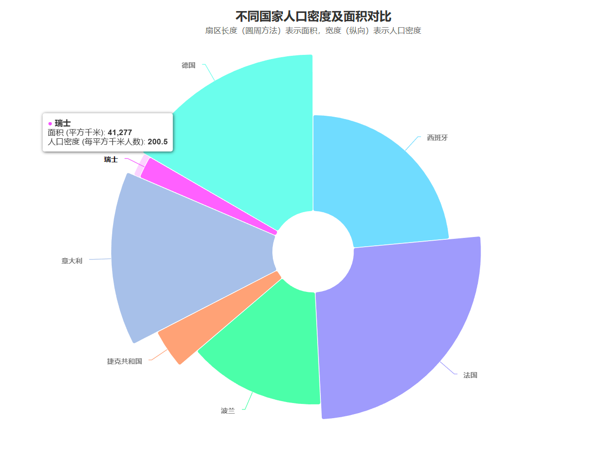
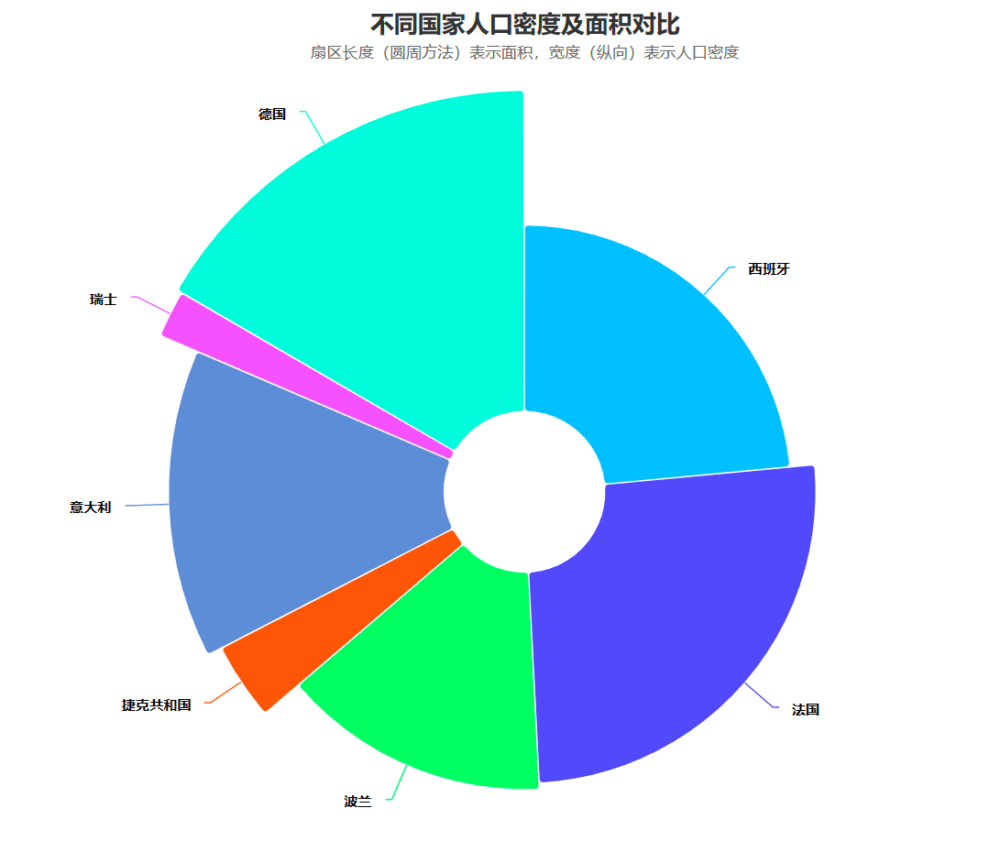

## 饼图

### 基础饼图

```html
<html lang="en">
<head>
    <meta charset="UTF-8">
    <title>基础条形图</title>

    <script src="./js/highcharts.js"></script>
    <script src="./js/exporting.js"></script>
    <script src="./js/series-label.js"></script>
    <script src="./js/zh_cn.js"></script>

</head>

<style>
    #container {
        width: 70vw;
        height: 70vh;
        position: absolute;
        top: 50%;
        left: 50%;
        transform: translate(-50%, -50%);
    }
</style>
<body>
<div id="container"></div>
<script>
    var chart = Highcharts.chart('container', {
        chart: {
            plotBackgroundColor: null,
            plotBorderWidth: null,
            plotShadow: false,
            type: 'pie'
        },
        title: {
            text: '2018年1月浏览器市场份额'
        },
        tooltip: {
            pointFormat: '{series.name}: <b>{point.percentage:.1f}%</b>'
        },
        plotOptions: {
            pie: {
                allowPointSelect: true,
                cursor: 'pointer',
                dataLabels: {
                    enabled: true,
                    format: '<b>{point.name}</b>: {point.percentage:.1f} %',
                    style: {
                        color: (Highcharts.theme && Highcharts.theme.contrastTextColor) || 'black'
                    }
                }
            }
        },
        series: [{
            name: 'Brands',
            colorByPoint: true,
            data: [{
                name: 'Chrome',
                y: 61.41,
                sliced: true,
                selected: true
            }, {
                name: 'Internet Explorer',
                y: 11.84
            }, {
                name: 'Firefox',
                y: 10.85
            }, {
                name: 'Edge',
                y: 4.67
            }, {
                name: 'Safari',
                y: 4.18
            }, {
                name: 'Sogou Explorer',
                y: 1.64
            }, {
                name: 'Opera',
                y: 1.6
            }, {
                name: 'QQ',
                y: 1.2
            }, {
                name: 'Other',
                y: 2.61
            }]
        }]
    })

    var a = 10;
    window.setInterval(() =>
    {
        chart.series[0].updateData([{
            name: 'Chrome',
            y: 61.41,
            sliced: true,
            selected: true
        }, {
            name: 'Internet Explorer',
            y: 11.84
        }, {
            name: 'Firefox',
            y: 10.85
        }, {
            name: 'Edge',
            y: 4.67
        }, {
            name: 'Safari',
            y: 4.18
        }, {
            name: 'Sogou Explorer',
            y: 1.64
        }, {
            name: 'Opera',
            y: 1.6
        }, {
            name: 'QQ',
            y: a += 3
        }, {
            name: 'Other',
            y: 2.61
        }])

        chart.redraw()
    }, 3000)

</script>

</body>
</html>
```











### 包含图例的饼图

```html
<html lang="en">
<head>
    <meta charset="UTF-8">
    <title>基础条形图</title>

    <script src="./js/highcharts.js"></script>
    <script src="./js/exporting.js"></script>
    <script src="./js/series-label.js"></script>
    <script src="./js/zh_cn.js"></script>

</head>

<style>
    #container {
        width: 70vw;
        height: 70vh;
        position: absolute;
        top: 50%;
        left: 50%;
        transform: translate(-50%, -50%);
    }
</style>
<body>
<div id="container"></div>
<script>
    var chart = Highcharts.chart('container', {
        chart: {
            plotBackgroundColor: null,
            plotBorderWidth: null,
            plotShadow: false,
            type: 'pie'
        },
        title: {
            text: '2018 年浏览器市场份额'
        },
        tooltip: {
            pointFormat: '{series.name}: <b>{point.percentage:.1f}%</b>'
        },
        plotOptions: {
            pie: {
                allowPointSelect: true,
                cursor: 'pointer',
                dataLabels: {
                    enabled: true
                },
                showInLegend: true
            }
        },
        series: [{
            name: 'Brands',
            colorByPoint: true,
            data: [{
                name: 'Chrome',
                y: 61.41,
                sliced: true,
                selected: true
            }, {
                name: 'Internet Explorer',
                y: 11.84
            }, {
                name: 'Firefox',
                y: 10.85
            }, {
                name: 'Edge',
                y: 4.67
            }, {
                name: 'Safari',
                y: 4.18
            }, {
                name: 'Other',
                y: 7.05
            }]
        }]
    })

</script>

</body>
</html>
```





### 扇形图

```html
<html lang="en">
<head>
    <meta charset="UTF-8">
    <title>扇形图</title>

    <script src="./js/highcharts.js"></script>
    <script src="./js/exporting.js"></script>
    <script src="./js/series-label.js"></script>
    <script src="./js/zh_cn.js"></script>

</head>

<style>
    #container {
        width: 70vw;
        height: 70vh;
        position: absolute;
        top: 50%;
        left: 50%;
        transform: translate(-50%, -50%);
    }
</style>
<body>
<div id="container"></div>
<script>
    var chart = Highcharts.chart('container', {
        title: {
            text: '浏览器<br>占比',
            align: 'center',
            verticalAlign: 'middle',
            y: 50
        },
        tooltip: {
            headerFormat: '{series.name}<br>',
            pointFormat: '{point.name}: <b>{point.percentage:.1f}%</b>'
        },
        plotOptions: {
            pie: {
                dataLabels: {
                    enabled: true,
                    distance: -50,
                    style: {
                        fontWeight: 'bold',
                        color: 'white',
                        textShadow: '0px 1px 2px black'
                    }
                },
                startAngle: -90, // 圆环的开始角度
                endAngle: 90,    // 圆环的结束角度
                center: ['50%', '75%']
            }
        },
        series: [{
            type: 'pie',
            name: '浏览器占比',
            innerSize: '50%',
            data: [
                ['Firefox', 45.0],
                ['IE', 26.8],
                ['Chrome', 12.8],
                ['Safari', 8.5],
                ['Opera', 6.2],
                {
                    name: '其他',
                    y: 0.7,
                    dataLabels: {
                        // 数据比较少，没有空间显示数据标签，所以将其关闭
                        enabled: false
                    }
                }
            ]
        }]
    });


</script>

</body>
</html>
```





### 可变宽度的环形图

```html
<html lang="en">
<head>
    <meta charset="UTF-8">
    <title>可变宽度的环形图</title>

    <script src="./js/highcharts.js"></script>
    <script src="./js/exporting.js"></script>
    <script src="./js/series-label.js"></script>
    <script src="./js/zh_cn.js"></script>
    <script src="https://code.hcharts.cn/highcharts/modules/variable-pie.js"></script>

</head>

<style>
    #container {
        width: 70vw;
        height: 70vh;
        position: absolute;
        top: 50%;
        left: 50%;
        transform: translate(-50%, -50%);
    }
</style>
<body>
<div id="container"></div>
<script>
    var chart = Highcharts.chart('container', {
        chart: {
            type: 'variablepie'
        },
        title: {
            text: '不同国家人口密度及面积对比'
        },
        subtitle: {
            text: '扇区长度（圆周方法）表示面积，宽度（纵向）表示人口密度'
        },
        tooltip: {
            headerFormat: '',
            pointFormat: '<span style="color:{point.color}">\u25CF</span> <b> {point.name}</b><br/>' +
                '面积 (平方千米): <b>{point.y}</b><br/>' +
                '人口密度 (每平方千米人数): <b>{point.z}</b><br/>'
        },
        series: [{
            minPointSize: 10,
            innerSize: '20%',
            zMin: 0,
            name: 'countries',
            data: [{
                name: '西班牙',
                y: 505370,
                z: 92.9
            }, {
                name: '法国',
                y: 551500,
                z: 118.7
            }, {
                name: '波兰',
                y: 312685,
                z: 124.6
            }, {
                name: '捷克共和国',
                y: 78867,
                z: 137.5
            }, {
                name: '意大利',
                y: 301340,
                z: 201.8
            }, {
                name: '瑞士',
                y: 41277,
                z: 214.5
            }, {
                name: '德国',
                y: 357022,
                z: 235.6
            }]
        }]
    })

    window.setInterval(() =>
    {
        var z1 = 92.9 + (Math.random() > 0.3 ? 26 : -12)
        var z2 = 118.7 + (Math.random() > 0.3 ? 28 : -13)
        var z3 = 124.6 + (Math.random() > 0.3 ? 19 : -12)
        var z4 = 137.5 + (Math.random() > 0.3 ? 28 : -12)
        var z5 = 201.8 + (Math.random() > 0.3 ? 39 : -16)
        var z6 = 214.5 + (Math.random() > 0.3 ? 32 : -14)
        var z7 = 235.6 + (Math.random() > 0.3 ? 20 : -10)

        var data = [{
            name: '西班牙',
            y: 505370,
            z: z1
        }, {
            name: '法国',
            y: 551500,
            z: z2
        }, {
            name: '波兰',
            y: 312685,
            z: z3
        }, {
            name: '捷克共和国',
            y: 78867,
            z: z4
        }, {
            name: '意大利',
            y: 301340,
            z: z5
        }, {
            name: '瑞士',
            y: 41277,
            z: z6
        }, {
            name: '德国',
            y: 357022,
            z: z7
        }]
        chart.series[0].updateData(data)
        chart.redraw();
    }, 2000)

</script>

</body>
</html>
```











